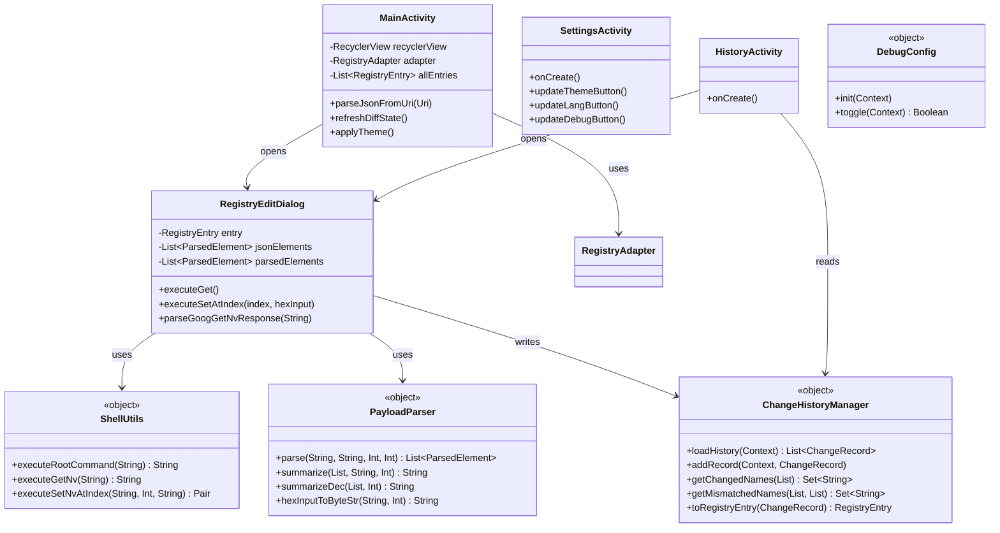

# NV Display Application - プログラム仕様書

## 1. システム概要
本アプリケーションは、Android（Pixel 8/9/10専用）環境上で、ルート権限（su）およびATコマンドを利用して、モデム等のNV（Non-Volatile）レジストリ値の閲覧および編集を行うツールです。
読み込んだJSONファイル（`nv_dump` 出力）をベースにパースし、デバイスの `/dev/umts_router` に対して直接GET/SETを行います。

## 2. アーキテクチャ構成

### 2.1 パッケージ構成
- **`net.snugplace.nvregistry`**: メインUI（Activity, Dialog）
- **`net.snugplace.nvregistry.adapter`**: RecyclerView用アダプタークラス
- **`net.snugplace.nvregistry.model`**: データモデル（JSONマップ用、履歴保存用）
- **`net.snugplace.nvregistry.util`**: ビジネスロジック、コマンド実行、永続化処理

### 2.2 クラス構造



## 3. 主要クラス・変数定義

### 3.1 変数・データ構造

**`RegistryEntry` (JSONデコード用データクラス)**
- `Index`: Int — レジストリインデックス（配列の場合）
- `RegistryName`: String — レジストリ名 (例: `RIL_AT_NV_NAME`)
- `Size`: Int — 1要素のバイト数 (1=u8, 2=u16, 4=u32/i32)
- `Count`: Int — 配列の要素数
- `TypeName`: String — データ型 ("u8", "u16", "u32", "i8", "i16", "i32", "String")
- `Payload`: String — カンマ区切りのHEX文字列（リトルエンディアン形式）

**`ParsedElement` (UI表示・パース用一時構造)**
- `index`: Int — UI行インデックス
- `hexDisplay`: String — 例: "0x0A0B" (ビッグエンディアンでのHEX視認用)
- `decValue`: String — 例: "2571" (符号付き十進数文字列)
- `originalBytes`: String — コマンドSETにそのまま送れるリトルエンディアンHEX (例: "0B,0A")

**`ChangeRecord` (変更履歴永続化)**
- `timestamp`: Long — UNIXエポックタイムスタンプ
- `registryName`: String — インデックス込みのレジストリ名 (`"NAME[0]"`)
- `jsonPayload`: String — SET時点での元のJSONペイロード
- `valueBeforeChange`: String — SET前に取得していたHEX値
- `newValue`: String — ユーザーが入力したSET値
- `postSetGetResult`: String — SET直後に自動GETして得たRAWレスポンス
- `success`: Boolean — SET結果にOKが含まれているか等からの合否
- `typeName`, `size`, `count`, `index`: RegistryEntry再構築用のメタデータ

## 4. ATコマンド仕様・通信処理

通信は `/dev/umts_router` に対して直接読み書きを行います。
処理は `ShellUtils.kt` で非同期スレッドを回してデッドロックを防止しています。

### 4.1 GET コマンド
tail -f でレスポンスの出力ストリームを開きながらコマンドを叩きます。レスポンスが複数行になる場合に対応するためです。

```sh
tail -f /dev/umts_router &
TAIL_PID=$!
sleep 0.3
echo 'AT+GOOGGETNV="<RegistryName>"\r' > /dev/umts_router
sleep 1.5
kill $TAIL_PID 2>/dev/null
```

**受信RAWデータ例（1行形式）：**
```
+GOOGGETNV: "NAME",0,"01,00,19,00"
OK
```

**受信RAWデータ例（複数行形式）：**
```
+GOOGGETNV: "NAME",0,"01,00"
+GOOGGETNV: "NAME",1,"19,00"
OK
```

**差分記録の連動：**
GET実行後、復元したPayload値が元のJSONのPayload値（スペース除去比較など）と相違していることが判明した場合、自動的に「GET diff」として `ChangeRecord` へ履歴に追加されます。これにより、手動でSETしていなくてもTOP画面で緑色にハイライトされます。

### 4.2 SET コマンド
指定したインデックス (`<idx>`) に対して、所定のバイト数（リトルエンディアン・カンマ区切り）を書き込みます。

```sh
echo 'AT+GOOGSETNV="<RegistryName>",<idx>,"<bytes>"\r' > /dev/umts_router
```

実行後、すぐに必ず GETコマンド を連続発行して結果を `postSetGetResult` に保存します。

## 5. 差分解析モジュール
`ChangeHistoryManager` により、履歴データと現在のJSONデータを比較します。

1. **`getChangedNames`**: 履歴に存在するレジストリ名（`[idx]`は除去）の一覧。トップ画面で「緑色」ハイライト用。
2. **`getMismatchedNames`**: 最新の履歴レコードの `jsonPayload` が、現在ロードされているJSONの `Payload` と相違する項目。トップ画面で「橙色」ハイライト用。
   （背景：SETしたときの元のJSONから、別の端末や古いJSONを現在読み込んでいることを視覚的に知らせるため）

## 6. その他設定管理
`SharedPreferences` (`nvregistry_prefs`) にて以下を永続化管理します。
- `is_dark_theme`: Boolean (テーマの白黒反転状態)
- `debug_enabled`: Boolean (デバッグログの出力有無)

デバッグログがONの場合、`Log.d("ShellUtils", ...)` などで詳細なプロセスの入出力がLogcatに流れます。
